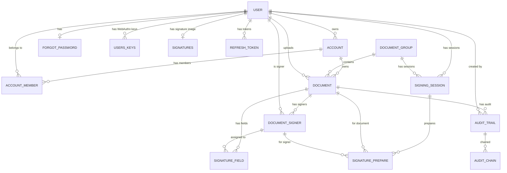

# Database Schema Skill

## ER Diagram



## Entities

### USER (table: `user`)
| Column | Java Field | Type | Constraints | Notes |
|--------|------------|------|-------------|-------|
| user_id | id | `String` (UUID) | PK, auto-generated UUID | JWT subject = this value |
| full_name | fullName | String | NOT NULL | |
| password_hash | password | String | NOT NULL, @JsonIgnore | BCrypt encoded |
| email | email | String | NOT NULL, UNIQUE | Login identifier |
| phone | phone | String | NOT NULL | |
| email_verified | emailVerified | boolean | NOT NULL, default=false | |

**Relationships:**
- `@OneToOne(mappedBy="user")` → ForgotPassword
- Referenced by: Account (owner), AccountMember, Document (uploadedBy), DocumentSigner, SignatureField, AuditTrail, UsersKeys, Signatures, RefreshToken

---

### ACCOUNT (table: `account`)
| Column | Java Field | Type | Constraints | Notes |
|--------|------------|------|-------------|-------|
| account_id | accountId | `Long` | PK, auto-increment | |
| owner_id | owner | User (FK) | NOT NULL | Creator of account |
| account_name | accountName | String | NOT NULL | |
| account_url | accountUrl | String | nullable | URL slug for organizations |
| account_type | accountType | AccountType enum | NOT NULL | PERSONAL or ORGANIZATION |

**Relationships:**
- `@OneToMany(mappedBy="account")` → AccountMember (cascade ALL)
- Referenced by: Document

---

### ACCOUNT_MEMBERS (table: `account_members`)
| Column | Java Field | Type | Constraints | Notes |
|--------|------------|------|-------------|-------|
| member_id | memberId | `Long` | PK, auto-increment | |
| account_id | account | Account (FK) | NOT NULL | |
| user_id | user | User (FK) | NOT NULL | |
| role | role | MemberRole enum | NOT NULL, default=MEMBER | ADMIN or MEMBER |
| can_upload | canUpload | Boolean | default=false | |
| can_sign | canSign | Boolean | default=false | |
| can_view_docs | canViewDocs | Boolean | default=false | |
| can_invite | canInvite | Boolean | default=false | |

**Unique constraint:** `(account_id, user_id)`

---

### DOCUMENT_GROUP (table: `document_group`)
| Column | Java Field | Type | Constraints | Notes |
|--------|------------|------|-------------|-------|
| group_id | groupId | `Integer` | PK, auto-increment | |
| group_name | groupName | String | | Display name |
| created_at | createdAt | LocalDateTime | auto @PrePersist | |
| current_step | currentStep | Integer | default=1 | UI wizard step (1-3) |
| group_status | gr_status | String | default="DRAFT" | Status as string (not enum) |
| expires_at | expiresAt | LocalDateTime | nullable | Signing deadline |

**Relationships:**
- `@OneToMany(mappedBy="documentGroup")` → Document

---

### DOCUMENTS (table: `documents`)
| Column | Java Field | Type | Constraints | Notes |
|--------|------------|------|-------------|-------|
| document_id | documentId | `Integer` | PK, auto-increment | |
| account_id | account | Account (FK) | NOT NULL | Owner account |
| uploaded_by | uploadedBy | User (FK) | NOT NULL | Who uploaded |
| original_file_url | originalFileUrl | String | NOT NULL | MinIO object key |
| original_file_hash | originalFileHash | String | nullable | SHA-256 of original |
| final_file_url | finalFileUrl | String | nullable | After all signatures |
| final_file_hash | finalFileHash | String | nullable | |
| status | status | DocumentStatus enum | default=DRAFT | |
| expiration_at | expirationAt | LocalDateTime | nullable | |
| created_at | createdAt | LocalDateTime | auto, not updatable | |
| updated_at | updatedAt | LocalDateTime | auto | |
| complete_at | completeAt | LocalDateTime | nullable | |
| cancelled_at | cancelledAt | LocalDateTime | nullable | |
| cancelled_by | cancelledBy | LocalDateTime | nullable | ⚠️ Should be String/User |
| group_id | documentGroup | DocumentGroup (FK) | nullable | |

---

### DOCUMENT_SIGNERS (table: `document_signers`)
| Column | Java Field | Type | Constraints | Notes |
|--------|------------|------|-------------|-------|
| doc_signer_id | docSignerId | `Integer` | PK, auto-increment | |
| document_id | document | Document (FK) | NOT NULL | |
| user_id | user | User (FK) | nullable | Resolved from email |
| signer_email | signerEmail | String(150) | NOT NULL | |
| signer_name | signerName | String(200) | nullable | |
| role | role | String(50) | default="signer" | |
| signing_order | signingOrder | Integer | default=1 | |
| signing_mode | signingMode | SigningMode enum | default=PARALLEL | |
| status | status | SignerStatus enum | default=WAITING | |
| signed_at | signedAt | LocalDateTime | nullable | |
| ip_address | ipAddress | String(45) | nullable | |
| credential_id | credentialId | String | nullable | WebAuthn |
| key_algorithm | keyAlgorithm | String(50) | nullable | |
| message_to_sign_hash | messageToSignHash | String | nullable | |
| digital_signature | digitalSignature | TEXT | nullable | |
| signature_format | signatureFormat | SignatureFormat enum | default=WEBAUTHN | |
| device_fingerprint | deviceFingerprint | String(512) | nullable | |
| sent_at | sentAt | LocalDateTime | nullable | When doc was sent |
| opened_at | openedAt | LocalDateTime | nullable | |
| created_at | createdAt | LocalDateTime | auto, not updatable | |

---

### SIGNATURE_FIELDS (table: `signature_fields`)
| Column | Java Field | Type | Constraints | Notes |
|--------|------------|------|-------------|-------|
| field_id | fieldId | `Integer` | PK, auto-increment | |
| document_id | document | Document (FK) | NOT NULL | |
| doc_signer_id | docSigner | DocumentSigner (FK) | nullable | |
| user_id | user | User (FK) | nullable | |
| page_number | pageNumber | Integer | NOT NULL | |
| pos_x | posX | Float | nullable | |
| pos_y | posY | Float | nullable | |
| width | width | Float | nullable | |
| height | height | Float | nullable | |
| field_type | fieldType | FieldType enum | default=SIGNATURE | |
| value | value | TEXT | nullable | Filled when signed |
| created_at | createdAt | LocalDateTime | auto, not updatable | |

---

### SIGNATURES (table: `signatures`)
| Column | Java Field | Type | Constraints | Notes |
|--------|------------|------|-------------|-------|
| signature_id | signatureId | `Long` | PK, auto-increment | |
| user_id | user | User (FK) | NOT NULL, UNIQUE | One signature per user |
| signature_type | signatureType | SignatureType enum | NOT NULL | DRAWN, UPLOADED, TYPED |
| image_url | imageUrl | String | nullable | MinIO URL |
| image_hash | imageHash | String | nullable | |
| text_style | textStyle | String | nullable | Font style for TYPED |
| created_at | createdAt | LocalDateTime | NOT NULL, auto | |

---

### USERS_KEYS (table: `users_keys`)
| Column | Java Field | Type | Constraints | Notes |
|--------|------------|------|-------------|-------|
| key_id | keyId | `Long` | PK, auto-increment | |
| user_id | user | User (FK) | NOT NULL | |
| credential_id | credentialId | String | NOT NULL, UNIQUE | Base64URL encoded |
| public_key_cose | publicKeyCose | byte[] (LOB) | NOT NULL | CBOR serialized |
| algorithm | algorithm | String | NOT NULL | e.g. "ES256" |
| aaguid | aaguid | String(64) | nullable | |
| attestation_format | attestationFormat | String(50) | nullable | |
| counter | counter | Long | default=0 | |
| is_active | isActive | Boolean | default=true | |
| created_at | createdAt | LocalDateTime | auto | |

---

### AUDIT_TRAIL (table: `audit_trail`)
| Column | Java Field | Type | Constraints | Notes |
|--------|------------|------|-------------|-------|
| audit_id | auditId | `Long` | PK, auto-increment | |
| document_id | document | Document (FK) | NOT NULL | Indexed |
| event_type | eventType | AuditEvent enum | NOT NULL | |
| event_description | eventDescription | TEXT | nullable | |
| signer_email | signerEmail | String(150) | nullable | |
| signer_name | signerName | String(200) | nullable | |
| signer_ip | signerIp | String(45) | nullable | |
| device_fingerprint | deviceFingerprint | String(512) | nullable | |
| pdf_hash_before | pdfHashBefore | String | nullable | |
| pdf_hash_after | pdfHashAfter | String | nullable | |
| credential_id | credentialId | String | nullable | |
| digital_signature | digitalSignature | TEXT | nullable | |
| message_to_sign_hash | messageToSignHash | String | nullable | |
| key_algorithm | keyAlgorithm | String(50) | nullable | |
| event_data | eventData | TEXT | nullable | JSON extensible |
| timestamp | timestamp | LocalDateTime | auto, not updatable | |
| created_by | createdBy | User (FK) | nullable | |

---

### AUDIT_CHAIN (table: `audit_chain`)
| Column | Java Field | Type | Constraints | Notes |
|--------|------------|------|-------------|-------|
| chain_id | chainId | `Long` | PK, auto-increment | |
| audit_id | auditTrail | AuditTrail (FK) | NOT NULL | |
| prev_hash | prevHash | String | nullable | null if first entry |
| entry_hash | entryHash | String | NOT NULL | SHA-256(audit_id + data + prev_hash) |
| created_at | createdAt | LocalDateTime | auto, not updatable | |

---

### SIGNING_SESSIONS (table: `signing_sessions`)
| Column | Java Field | Type | Constraints | Notes |
|--------|------------|------|-------------|-------|
| session_id | sessionId | `Integer` | PK, auto-increment | |
| user_id | user | User (FK) | NOT NULL | Cho phép 1 session ký nhiều documents |
| group_id | groupId | Integer | nullable | Group ID đang ký |
| challenge | challenge | String | NOT NULL | WebAuthn nonce |
| rp_id | rpId | String | nullable | Relying Party ID |
| origin | origin | String | nullable | |
| assertion_verified | assertionVerified | Boolean | default=false | |
| status | status | SessionStatus enum | default=ACTIVE | |
| created_at | createdAt | LocalDateTime | auto, not updatable | |
| expires_at | expiresAt | LocalDateTime | auto (+10min) | |
| used_at | usedAt | LocalDateTime | nullable | |
| used_from_ip | usedFromIp | String(45) | nullable | |
| used_from_ua | usedFromUa | TEXT | nullable | |
| device_fingerprint | deviceFingerprint | String(512) | nullable | |

---

### SIGNATURE_PREPARES (table: `signature_prepares`)
| Column | Java Field | Type | Constraints | Notes |
|--------|------------|------|-------------|-------|
| prepare_id | prepareId | `Long` | PK, auto-increment | |
| signing_session_id | signingSession | SigningSession (FK) | NOT NULL | |
| document_id | document | Document (FK) | NOT NULL | |
| doc_signer_id | docSigner | DocumentSigner (FK) | NOT NULL | |
| message_to_sign | messageToSign | TEXT | NOT NULL | Canonicalized JSON |
| message_to_sign_hash | messageToSignHash | String | NOT NULL | SHA-256 of message |
| created_at | createdAt | LocalDateTime | auto, not updatable | |

---

### AUTH TABLES

**INVALIDATED_TOKEN** (table: `invalidated_token`)
| Column | Java Field | Type | Notes |
|--------|------------|------|-------|
| id | id | `String` | PK — JWT ID (jti) |
| expirytime | expirytime | Date | Token expiry |

**REFRESH_TOKEN** (table: `refresh_token`)
| Column | Java Field | Type | Notes |
|--------|------------|------|-------|
| token | token | `String` | PK — the refresh token string |
| user | user | User (FK) | |
| exprity_date | exprityDate | Date | ⚠️ typo in field name |
| revoked | revoked | boolean | |
| account_id | accountId | Long | Which account context |

**FORGOT_PASSWORD** (table: `forgot_password`)
| Column | Java Field | Type | Notes |
|--------|------------|------|-------|
| fpid | fpid | `Integer` | PK, auto-increment |
| otp | otp | Integer | NOT NULL |
| expired_at | expiredAt | Date | NOT NULL |
| user | user | User (FK) | @OneToOne |

---

### NOTIFICATIONS & INVITATIONS

**NOTIFICATION** (table: `notifications`)
| Column | Java Field | Type | Notes |
|--------|------------|------|-------|
| notification_id | notificationId | `Long` | PK, auto-increment |
| recipient_email | recipientEmail | String | NOT NULL, Global inbox ID |
| notification_type | notificationType | Notifications enum | NOT NULL |
| title | title | String | NOT NULL |
| message | message | TEXT | NOT NULL |
| group_id | groupId | Integer | nullable |
| sender_name | senderName | String | nullable |
| sender_email | senderEmail | String | nullable |
| is_read | isRead | Boolean | default=false |
| created_at | createdAt | LocalDateTime | auto |
| read_at | readAt | LocalDateTime | nullable |

**ORG_INVITATION** (table: `org_invitations`)
| Column | Java Field | Type | Notes |
|--------|------------|------|-------|
| id | id | `Long` | PK, auto-increment |
| account_id | account | Account (FK) | NOT NULL |
| email | email | String | NOT NULL |
| role | role | MemberRole enum | NOT NULL |
| token | token | String | NOT NULL, UNIQUE (invite link token) |
| status | status | InvitationStatus enum | PENDING, ACCEPTED, EXPIRED, CANCELLED |
| expires_at | expiresAt | LocalDateTime | NOT NULL |
| created_at | createdAt | LocalDateTime | auto |
| created_by | createdBy | User (FK) | Who sent the invite |

**ORGANIZATION_KEYS** (table: `organization_keys`)
| Column | Java Field | Type | Notes |
|--------|------------|------|-------|
| key_id | keyId | `Long` | PK, auto-increment |
| account_id | account | Account (FK) | NOT NULL, Organization Account |
| credential_id | credentialId | String | NOT NULL, UNIQUE |
| public_key_cose | publicKeyCose | byte[] | NOT NULL |
| algorithm | algorithm | String | NOT NULL |
| aaguid | aaguid | String(64) | nullable |
| attestation_format | attestationFormat | String(50) | nullable |
| counter | counter | Long | default=0 |
| is_active | isActive | Boolean | default=true |
| created_at | createdAt | LocalDateTime | auto |

---

## All Enums

```java
// Document lifecycle
enum DocumentStatus { DRAFT, PENDING, COMPLETED, DECLINED, EXPIRED, VOID }

// Signer state within a document
enum SignerStatus { WAITING, VIEWED, SIGNED, DECLINED, EXPIRED }

// Signing order mode
enum SigningMode { SEQUENTIAL, PARALLEL }

// Field types on PDF
enum FieldType { SIGNATURE, TEXT, CHECKBOX, DATE, EMAIL, NAME, INITIAL, NUMBER }

// Account types
enum AccountType { PERSONAL, ORGANIZATION }

// Organization member role
enum MemberRole { ADMIN, MEMBER }

// Signature creation method
enum SignatureType { DRAWN("drawn"), UPLOADED("uploaded"), TYPED("typed") }

// Digital signature format
enum SignatureFormat { WEBAUTHN, PKCS1, PKCS7, RAW }

// WebAuthn session state
enum SessionStatus { ACTIVE, USED, EXPIRED, REVOKED }

// Audit log events
enum AuditEvent { UPLOAD, SENT, VIEWED, SIGNED, DECLINED, COMPLETED, EXPIRED, VOIDED, DOWNLOADED }
```

## PK Types Quick Reference

| Entity | PK Field | Java Type | Generation |
|--------|----------|-----------|------------|
| User | id | **String (UUID)** | `GenerationType.UUID` |
| Account | accountId | **Long** | `IDENTITY` |
| AccountMember | memberId | **Long** | `IDENTITY` |
| DocumentGroup | groupId | **Integer** | `IDENTITY` |
| Document | documentId | **Integer** | `IDENTITY` |
| DocumentSigner | docSignerId | **Integer** | `IDENTITY` |
| SignatureField | fieldId | **Integer** | `IDENTITY` |
| Signatures | signatureId | **Long** | `IDENTITY` |
| UsersKeys | keyId | **Long** | `IDENTITY` |
| AuditTrail | auditId | **Long** | `IDENTITY` |
| AuditChain | chainId | **Long** | `IDENTITY` |
| SigningSession | sessionId | **Integer** | `IDENTITY` |
| SignaturePrepare | prepareId | **Long** | `IDENTITY` |
| InvalidatedToken | id | **String** | manual (jti) |
| RefreshToken | token | **String** | manual |
| ForgotPassword | fpid | **Integer** | `IDENTITY` |

## Important Notes

> ⚠️ `User.id` is accessed via `getId()` (Lombok @Data on field `id`), NOT `getUserId()`. Code uses `authentication.getName()` which returns JWT subject = `User.id` (UUID string).

> ⚠️ `DocumentGroup.gr_status` is stored as `String`, not as `DocumentStatus` enum. Comparisons use `String.valueOf(DocumentStatus.PENDING)`.

> ⚠️ `Document.cancelledBy` is typed as `LocalDateTime` but semantically should be a user reference — likely a bug.

> ⚠️ `RefreshToken.exprityDate` has a typo (should be `expiryDate`).
