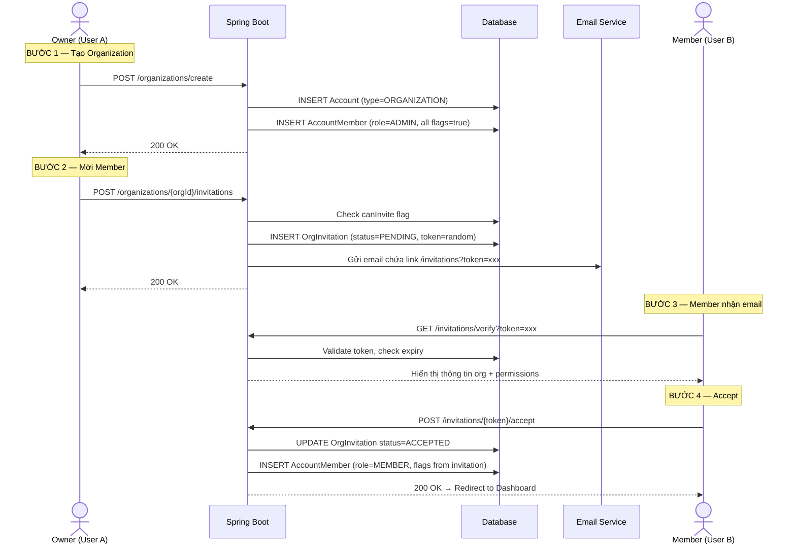
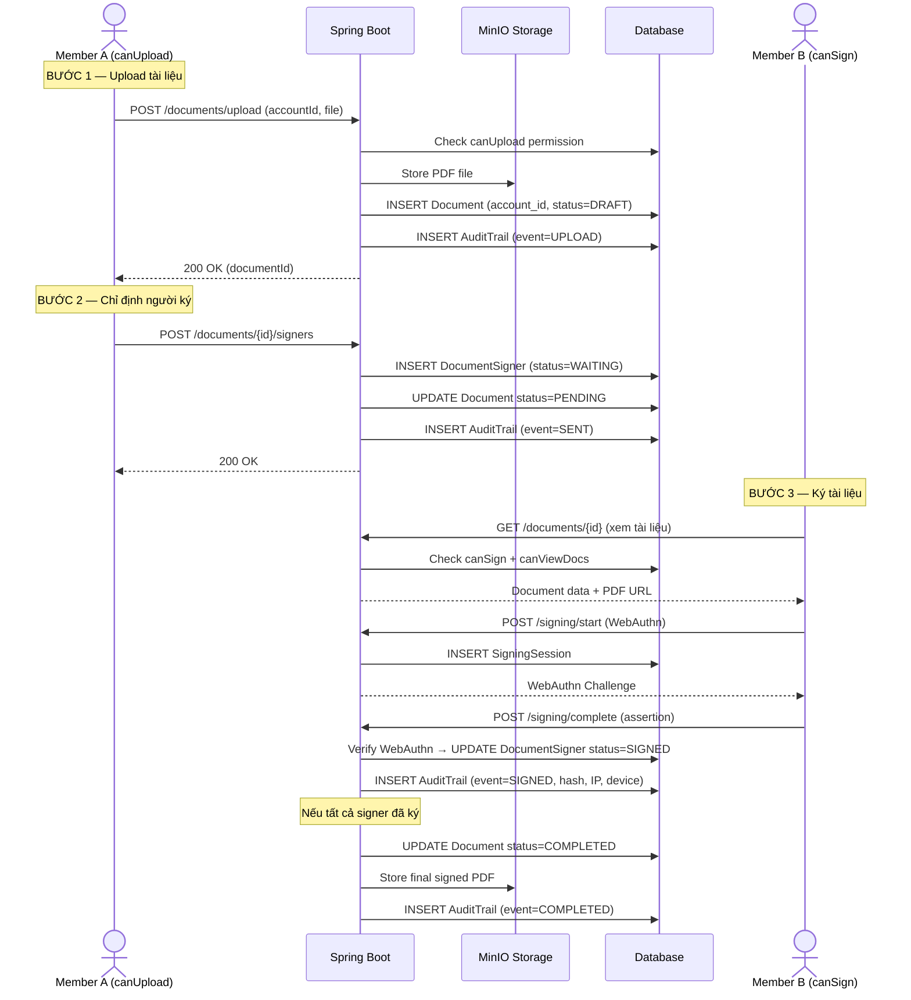

# Phân Tích Organization Trong Hệ Thống eSign

> Phân tích dưới góc nhìn Software Architect, phù hợp đồ án tốt nghiệp cử nhân IT.

---

## 1. Vì Sao eSign Cần Organization?

### Nếu chỉ có User cá nhân — Hệ thống thiếu gì?

| Vấn đề | Mô tả |
|---------|--------|
| **Không có không gian chung** | Mỗi user chỉ thấy tài liệu của mình, không thể cộng tác trong công ty |
| **Không phân quyền được** | Ai cũng upload/ký như nhau, không kiểm soát được ai được làm gì |
| **Không quản lý thành viên** | Không biết ai thuộc công ty nào, không mời/xóa người được |
| **Tài liệu phân tán** | Hợp đồng công ty nằm rải rác ở account cá nhân, không ai quản lý tập trung |
| **Không có audit tập trung** | Không truy vết được hoạt động theo tổ chức |

### Organization giải quyết gì?

```
User cá nhân ─── ký cho chính mình (freelancer, cá nhân)
       │
       └──► Tham gia Organization ──► Ký dưới danh nghĩa tổ chức
                                       ├── Tài liệu thuộc về tổ chức
                                       ├── Admin kiểm soát ai được làm gì  
                                       ├── Quản lý thành viên tập trung
                                       └── Audit log theo tổ chức
```

### 3 tình huống thực tế

1. **Công ty nhỏ (5-20 người)**: Giám đốc tạo Organization → mời nhân viên → phân quyền → nhân viên upload hợp đồng → chỉ định giám đốc ký duyệt
2. **Phòng Nhân sự**: HR upload hợp đồng lao động → gửi cho nhân viên mới ký → giám đốc ký → lưu trữ tập trung
3. **Freelancer**: Dùng account PERSONAL, tự upload và ký tài liệu cá nhân, không cần Organization

---

## 2. Các Nghiệp Vụ Của Organization

### Bảng đánh giá chức năng

| # | Chức năng | Actor | Độ ưu tiên | Nên làm? | Lý do |
|---|-----------|-------|------------|----------|-------|
| 1 | Tạo Organization | User | 🔴 Bắt buộc | ✅ | Nền tảng mọi thứ |
| 2 | Mời member qua email | Admin | 🔴 Bắt buộc | ✅ | Flow cốt lõi |
| 3 | Accept/Reject lời mời | Member | 🔴 Bắt buộc | ✅ | Đã có sẵn |
| 4 | Phân quyền cho member | Admin | 🔴 Bắt buộc | ✅ | Điểm nhấn đồ án |
| 5 | Upload tài liệu trong org | Admin/Member | 🔴 Bắt buộc | ✅ | Nghiệp vụ chính |
| 6 | Gửi yêu cầu ký | Admin/Member | 🔴 Bắt buộc | ✅ | Đã có sẵn |
| 7 | Theo dõi trạng thái ký | Admin/Member | 🔴 Bắt buộc | ✅ | Đã có sẵn |
| 8 | Audit log cơ bản | Admin | 🟡 Nên có | ✅ | Đã có AuditTrail |
| 9 | Xem danh sách member | Admin | 🟡 Nên có | ✅ | Đơn giản |
| 10 | Xóa/Remove member | Admin | 🟡 Nên có | ✅ | Cần thiết |
| 11 | Cập nhật quyền member | Admin | 🟡 Nên có | ✅ | Đã có flag |
| 12 | Xóa Organization | Owner | 🟢 Có thể | ✅ | Đã làm |
| 13 | Team/Department | Admin | 🔵 Nâng cao | ❌ | Quá phức tạp |
| 14 | Template tài liệu | Admin | 🔵 Nâng cao | ❌ | Không cần thiết |
| 15 | Billing/Subscription | - | 🔵 Nâng cao | ❌ | Ngoài scope |
| 16 | Con dấu tổ chức | Admin | 🔵 Nâng cao | ❌ | Phức tạp |

### Chi tiết từng chức năng quan trọng

#### 1. Tạo Organization
- **Mục đích**: Tạo workspace chung cho nhóm/công ty
- **Actor**: Bất kỳ user đã đăng ký
- **Logic**: User tạo → tự động trở thành Owner (ADMIN) với đầy đủ quyền
- **Đã có**: ✅ `OrganizationService.createOrganization()`

#### 2. Mời Member qua Email
- **Mục đích**: Thêm người vào tổ chức một cách bảo mật
- **Actor**: Admin hoặc Member có `canInvite = true`
- **Logic**: Gửi email chứa token → Member click link → Accept/Reject
- **Đã có**: ✅ `OrganizationService.inviteMember()`

#### 3. Phân quyền
- **Mục đích**: Admin kiểm soát member được làm gì trong tổ chức
- **Actor**: Admin (Owner)
- **Logic**: Cấp/thu hồi 4 permission flags cho từng member
- **Đã có**: ✅ Các flag trong `AccountMember`

#### 4. Upload tài liệu trong Org
- **Mục đích**: Tài liệu thuộc về tổ chức, không phải cá nhân
- **Actor**: Member có `canUpload = true`
- **Logic**: Upload PDF → gắn `account_id` → lưu MinIO
- **Đã có**: ✅ Document entity có FK `account_id`

#### 5. Quản lý Member (Xem/Xóa/Sửa quyền)
- **Mục đích**: Admin quản lý nhân sự trong org
- **Actor**: Admin
- **Logic**: List members → Update permission flags → Remove member
- **Cần bổ sung**: API list members, update permissions, remove member

---

## 3. Phân Tích Role & Permission

### Hệ thống hiện tại

```
MemberRole: ADMIN | MEMBER
```

```
AccountMember flags:
  ├── canUpload    (upload tài liệu)
  ├── canSign      (ký tài liệu)  
  ├── canViewDocs  (xem tài liệu của org)
  └── canInvite    (mời thành viên mới)
```

### Đánh giá: Thiết kế hiện tại ĐÃ PHÙ HỢP cho đồ án

> [!IMPORTANT]
> **Không nên thay đổi sang RBAC phức tạp.** Hệ thống hiện tại dùng **Role + Permission Flags** — đây là cách tiếp cận đúng đắn cho quy mô đồ án.

#### Vì sao KHÔNG cần RBAC phức tạp (bảng roles, permissions riêng)?

| Tiêu chí | Permission Flags (hiện tại) | RBAC đầy đủ |
|-----------|---------------------------|-------------|
| Độ phức tạp | ⭐ Đơn giản | ⭐⭐⭐ Phức tạp |
| Số bảng cần thêm | 0 | 2-3 bảng |
| Đủ cho đồ án | ✅ | Quá mức |
| Dễ demo | ✅ | Khó giải thích |
| Performance | Nhanh (1 query) | Chậm hơn (JOIN) |

### Admin được phép làm gì?

| Hành động | Admin | Giải thích |
|-----------|-------|------------|
| Tất cả quyền của Member | ✅ | Admin có full permission |
| Mời member | ✅ | Luôn có quyền |
| Xóa member | ✅ | Chỉ Admin |
| Cập nhật quyền member | ✅ | Chỉ Admin |
| Xóa Organization | ✅ (Owner) | Chỉ Owner |
| Upload tài liệu | ✅ | Luôn có quyền |
| Ký tài liệu | ✅ | Luôn có quyền |
| Xem tài liệu | ✅ | Luôn có quyền |
| Hủy tài liệu | ✅ | Chỉ Admin hoặc người upload |

### Member được phép làm gì?

| Hành động | Member | Phụ thuộc |
|-----------|--------|-----------|
| Upload tài liệu | Tùy | `canUpload = true` |
| Ký tài liệu | Tùy | `canSign = true` |
| Xem tài liệu org | Tùy | `canViewDocs = true` |
| Mời member khác | Tùy | `canInvite = true` |
| Xóa member | ❌ | Không bao giờ |
| Cập nhật quyền | ❌ | Không bao giờ |
| Xóa Organization | ❌ | Không bao giờ |

### Cách kiểm tra quyền trong code

```java
// Pattern hiện tại — GIỮ NGUYÊN, rất tốt
public void checkPermission(Long accountId, String userId, String permission) {
    AccountMember member = accountMemberRepository
        .findByAccount_AccountIdAndUser_Id(accountId, userId)
        .orElseThrow(() -> new AppException(ErrorCode.USER_NO_PERMISSION));
    
    // Admin luôn có full quyền
    if (member.getRole() == MemberRole.ADMIN) return;
    
    // Member kiểm tra từng flag
    switch (permission) {
        case "UPLOAD"   -> { if (!Boolean.TRUE.equals(member.getCanUpload()))   throw ...; }
        case "SIGN"     -> { if (!Boolean.TRUE.equals(member.getCanSign()))     throw ...; }
        case "VIEW"     -> { if (!Boolean.TRUE.equals(member.getCanViewDocs())) throw ...; }
        case "INVITE"   -> { if (!Boolean.TRUE.equals(member.getCanInvite()))   throw ...; }
    }
}
```

---

## 4. Luồng Nghiệp Vụ Step-by-Step

### Flow 1: Tạo Organization & Mời Member



### Flow 2: Upload & Ký Tài Liệu trong Organization



### Trạng thái Document

```
DRAFT → PENDING → COMPLETED
  │        │
  │        ├──→ DECLINED (signer từ chối)
  │        └──→ EXPIRED (hết hạn)
  │
  └──→ VOID (Admin hủy)
```

---

## 5. Mapping Nghiệp Vụ Với Database Hiện Có

### Sơ đồ quan hệ hiện tại

```mermaid
erDiagram
    USER ||--o{ ACCOUNT : "owns (1 user can own many orgs)"
    ACCOUNT ||--o{ ACCOUNT_MEMBER : "has members"
    USER ||--o{ ACCOUNT_MEMBER : "joins orgs"
    ACCOUNT ||--o{ DOCUMENT : "contains"
    USER ||--o{ DOCUMENT : "uploads"
    DOCUMENT ||--o{ DOCUMENT_SIGNER : "has signers"
    USER ||--o{ DOCUMENT_SIGNER : "is signer"
    DOCUMENT ||--o{ AUDIT_TRAIL : "has audit"
    AUDIT_TRAIL ||--|| AUDIT_CHAIN : "chain integrity"
    ACCOUNT ||--o{ ORG_INVITATION : "has invitations"
    DOCUMENT }o--|| DOCUMENT_GROUP : "belongs to group"

    USER {
        string user_id PK
        string full_name
        string email UK
        string phone
        boolean email_verified
    }

    ACCOUNT {
        long account_id PK
        string owner_id FK
        string account_name
        string account_url UK
        enum account_type
    }

    ACCOUNT_MEMBER {
        long member_id PK
        long account_id FK
        string user_id FK
        enum role
        boolean can_upload
        boolean can_sign
        boolean can_view_docs
        boolean can_invite
    }

    DOCUMENT {
        int document_id PK
        long account_id FK
        string uploaded_by FK
        string original_file_url
        string original_file_hash
        string final_file_url
        string final_file_hash
        enum status
    }
```



### Mapping nghiệp vụ → bảng

| Nghiệp vụ | Bảng sử dụng | Field quan trọng |
|------------|--------------|-----------------|
| Tạo Organization | `Account` + `AccountMember` | `account_type`, `owner_id`, `role=ADMIN` |
| Mời member | `OrgInvitation` | `token`, `status`, `expires_at`, permission flags |
| Accept lời mời | `OrgInvitation` + `AccountMember` | `status=ACCEPTED`, copy permission flags |
| Upload tài liệu | `Document` + `AuditTrail` | `account_id`, `uploaded_by`, `status=DRAFT` |
| Chỉ định người ký | `DocumentSigner` | `document_id`, `user_id`, `signing_order` |
| Ký tài liệu | `SigningSession` + `DocumentSigner` + `AuditTrail` | WebAuthn data, hash, IP |
| Hoàn thành | `Document` + `AuditTrail` + `AuditChain` | `status=COMPLETED`, hash chain |

### Những gì CẦN BỔ SUNG (API, không cần thêm bảng)

| API cần thêm | Method | Bảng dùng | Logic |
|---------------|--------|-----------|-------|
| List members của org | `GET /organizations/{id}/members` | `AccountMember` | Query by `account_id` |
| Update quyền member | `PUT /organizations/{id}/members/{memberId}` | `AccountMember` | Update permission flags |
| Remove member | `DELETE /organizations/{id}/members/{memberId}` | `AccountMember` | Delete row (hoặc soft delete) |
| List documents của org | `GET /organizations/{id}/documents` | `Document` | Query by `account_id` |
| Lấy audit log của org | `GET /organizations/{id}/audit-logs` | `AuditTrail` JOIN `Document` | Filter by `account_id` |

> [!NOTE]
> **Không cần thêm bảng mới nào!** Database hiện tại đã đủ cho tất cả nghiệp vụ core. Chỉ cần thêm API endpoints và service methods.

---

## 6. Roadmap Triển Khai

### 🔴 Phase 1 — Core (Bắt buộc cho demo)

> Đã hoàn thành phần lớn. Cần polish.

| # | Feature | Trạng thái | Ghi chú |
|---|---------|-----------|---------|
| 1 | Tạo Organization | ✅ Done | |
| 2 | Mời member qua email | ✅ Done | |
| 3 | Accept/Reject invitation | ✅ Done | |
| 4 | Upload tài liệu trong org | ✅ Done | Cần check `canUpload` |
| 5 | Gửi yêu cầu ký | ✅ Done | |
| 6 | Ký tài liệu (WebAuthn) | ✅ Done | |
| 7 | Xem trạng thái ký | ✅ Done | |
| 8 | Xóa Organization | ✅ Done | |

### 🟡 Phase 2 — Nên Có (Điểm cộng khi demo)

| # | Feature | Ước lượng | Giá trị demo |
|---|---------|-----------|-------------|
| 1 | API list members + UI | 2-3 giờ | Cao — Thể hiện quản lý org |
| 2 | API update permission + UI | 3-4 giờ | Rất cao — Điểm nhấn RBAC |
| 3 | API remove member | 1-2 giờ | Trung bình |
| 4 | List documents theo org | 2-3 giờ | Cao — Tài liệu tập trung |
| 5 | Permission checking middleware | 3-4 giờ | Cao — Security |
| 6 | Audit log viewer cho org | 3-4 giờ | Cao — Compliance |

### 🔵 Phase 3 — Nâng Cao (Bỏ nếu hết thời gian)

| # | Feature | Lý do bỏ |
|---|---------|----------|
| 1 | Team/Department | Quá phức tạp, cần thêm bảng |
| 2 | Template tài liệu | Ngoài scope ký điện tử |
| 3 | Billing/Subscription | Không cần cho đồ án |
| 4 | Con dấu tổ chức | Phức tạp, ít giá trị demo |
| 5 | Chuyển ownership | Edge case, ít gặp |

### Thứ tự triển khai đề xuất

```
Tuần 1: List members + UI hiển thị
Tuần 2: Update permission + Remove member
Tuần 3: Permission checking cho Document APIs
Tuần 4: Audit log viewer + Polish UI
```

---

## 7. Best Practices Cho Đồ Án

### 1. Permission Checking

```java
// ĐỀ XUẤT: Tạo utility method dùng chung
@Service
public class PermissionChecker {
    
    private final AccountMemberRepository memberRepo;
    
    /** Kiểm tra user có là member của org không */
    public AccountMember requireMembership(Long accountId, String userId) {
        return memberRepo.findByAccount_AccountIdAndUser_Id(accountId, userId)
            .orElseThrow(() -> new AppException(ErrorCode.USER_NO_PERMISSION));
    }
    
    /** Kiểm tra quyền cụ thể — Admin bypass tất cả */
    public void requirePermission(Long accountId, String userId, String perm) {
        AccountMember m = requireMembership(accountId, userId);
        if (m.getRole() == MemberRole.ADMIN) return; // Admin = full quyền
        
        boolean allowed = switch (perm) {
            case "UPLOAD"  -> Boolean.TRUE.equals(m.getCanUpload());
            case "SIGN"    -> Boolean.TRUE.equals(m.getCanSign());
            case "VIEW"    -> Boolean.TRUE.equals(m.getCanViewDocs());
            case "INVITE"  -> Boolean.TRUE.equals(m.getCanInvite());
            default        -> false;
        };
        if (!allowed) throw new AppException(ErrorCode.USER_NO_PERMISSION);
    }
    
    /** Chỉ Admin mới được thực hiện */
    public void requireAdmin(Long accountId, String userId) {
        AccountMember m = requireMembership(accountId, userId);
        if (m.getRole() != MemberRole.ADMIN) {
            throw new AppException(ErrorCode.USER_NO_PERMISSION);
        }
    }
}
```

### 2. Audit Log

```java
// Pattern hiện tại ĐÃ TỐT — tiếp tục dùng
// Mỗi action quan trọng → INSERT AuditTrail + AuditChain
// Không cần thay đổi gì
```

### 3. Quản lý File PDF

```
MinIO bucket structure:
  esign/
    ├── {account_id}/
    │   ├── {document_id}/
    │   │   ├── original.pdf          ← File gốc
    │   │   ├── v1_signed.pdf         ← Sau signer 1
    │   │   ├── v2_signed.pdf         ← Sau signer 2
    │   │   └── final_signed.pdf      ← Hoàn thành
```

### 4. Security Cơ Bản

| Nguyên tắc | Cách áp dụng |
|------------|-------------|
| **Mọi API org đều check membership** | Gọi `requireMembership()` đầu mỗi method |
| **Admin bypass permission flags** | `if (role == ADMIN) return` |
| **Invitation token an toàn** | SecureRandom 32 bytes ✅ đã có |
| **Token hết hạn** | 7 ngày ✅ đã có |
| **Chỉ invited user mới accept được** | Check email match ✅ đã có |
| **Soft delete cho member** | Tùy chọn — có thể dùng hard delete cho đơn giản |

### 5. Validation Nghiệp Vụ (Checklist)

```
□ Upload tài liệu → Check user là member + canUpload
□ Ký tài liệu → Check user là member + canSign
□ Xem tài liệu → Check user là member + canViewDocs  
□ Mời member → Check user là member + canInvite (hoặc ADMIN)
□ Xóa member → Check user là ADMIN
□ Cập nhật quyền → Check user là ADMIN
□ Xóa Organization → Check user là Owner
□ Mời user đã là member → Reject
□ Mời user đã có pending invitation → Reject
□ Accept invitation hết hạn → Reject
```

---

## 8. Tóm Tắt

### Điểm mạnh hiện tại
- ✅ Database design đầy đủ, không cần thêm bảng
- ✅ Invitation flow hoàn chỉnh
- ✅ Permission flags đơn giản, hiệu quả
- ✅ Audit trail + chain integrity
- ✅ WebAuthn signing

### Cần bổ sung để hoàn thiện
1. **3 API quản lý member**: list, update permissions, remove
2. **Permission checking utility**: Dùng chung cho tất cả Document APIs
3. **UI hiển thị members + permissions**: Trang quản lý org trong frontend
4. **Audit log viewer**: UI xem lịch sử hoạt động theo org

> [!TIP]
> **Ưu tiên làm Phase 2 items 1-2** (List members + Update permissions). Đây là điểm nhấn thể hiện "Organization Management" trong demo đồ án — giám khảo sẽ thấy ngay giá trị của module Organization.
